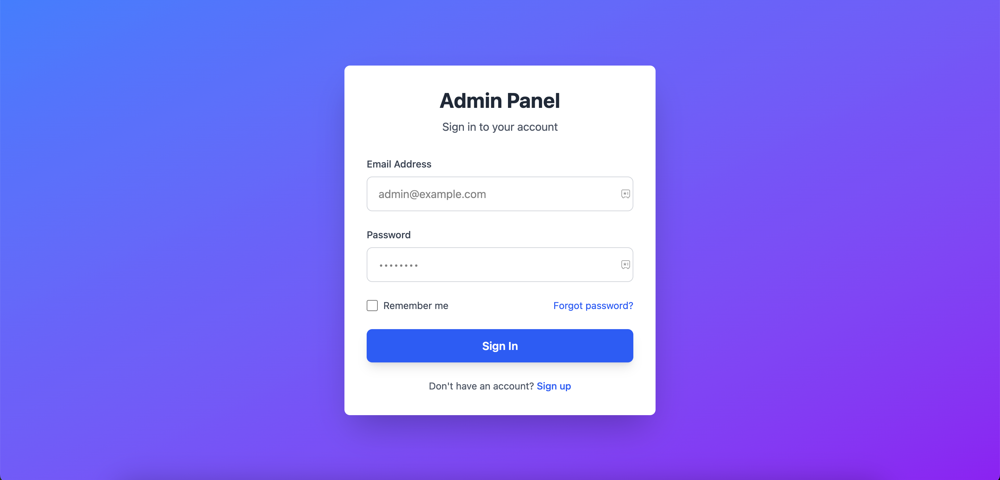
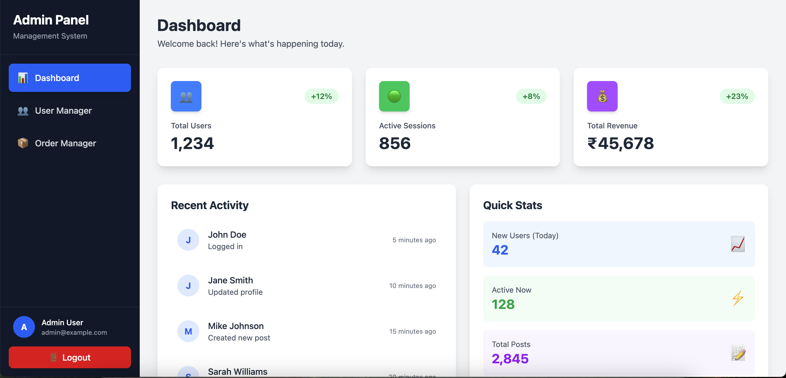
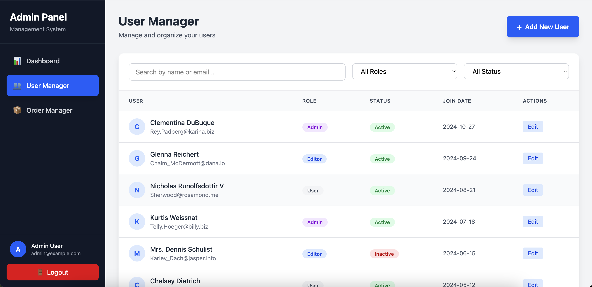
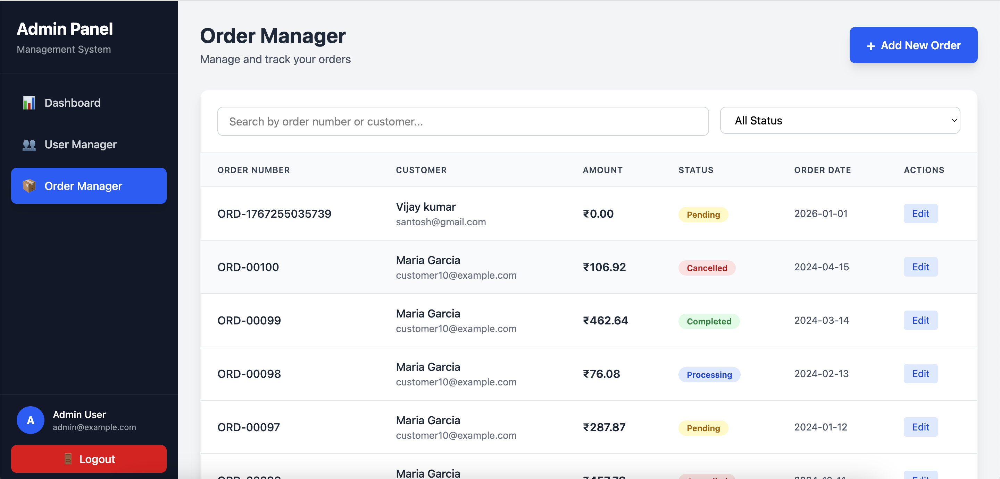

# Admin Dashboard Panel

A modern, responsive admin dashboard built with React, TypeScript, and Tailwind CSS. This application provides a complete admin interface for managing users and orders with authentication, CRUD operations, and real-time data visualization.

## Features

- **Authentication System**
  - Secure login with email and password
  - Session management with localStorage
  - Protected routes and automatic redirect

- **Dashboard Overview**
  - Real-time statistics and metrics
  - Visual data representation
  - Quick access to key information

- **User Management**
  - View all users with pagination
  - Add new users
  - Edit existing user details
  - View detailed user information
  - Filter and search functionality
  - Role and status management

- **Order Management**
  - Complete order tracking system
  - Create, read, update, and delete orders
  - Order status tracking (Pending, Processing, Completed, Cancelled)
  - Customer information management
  - Order details with itemized view

- **Responsive Design**
  - Mobile-friendly interface
  - Modern UI with Tailwind CSS
  - Smooth animations and transitions
  - Intuitive navigation with sidebar

## Screenshots

### Login Page


### Dashboard Overview


### User Management


### Order Management


## Tech Stack

- **Frontend Framework:** React 19.2.0
- **Language:** TypeScript 5.9.3
- **Build Tool:** Vite (with Rolldown)
- **Styling:** Tailwind CSS 4.1.18
- **State Management:** React Context API
- **API:** JSONPlaceholder (demo API)

## Prerequisites

Before you begin, ensure you have the following installed:
- Node.js (v18 or higher)
- npm or yarn package manager

## Installation

1. Clone the repository:
```bash
git clone <your-repository-url>
cd admin-panel
```

2. Install dependencies:
```bash
npm install
```
http://localhost:5173
```

## Login Credentials

Use the following credentials to access the dashboard:

- **Email:** admin@example.com
- **Password:** Secret@123

## Available Scripts

- `npm run dev` - Start development server
- `npm run build` - Build for production
- `npm run preview` - Preview production build
- `npm run lint` - Run ESLint for code quality

3. Set up environment variables (optional):
```bash
cp .env.example .env
```

4. Start the development server:
```bash
npm run dev
```

5. Open your browser and navigate to:
```
http://localhost:5173
```

## Login Credentials

Use the following credentials to access the dashboard:

- **Email:** admin@example.com
- **Password:** Secret@123

## Available Scripts

- `npm run dev` - Start development server
- `npm run build` - Build for production
- `npm run preview` - Preview production build
- `npm run lint` - Run ESLint for code quality

## Project Structure

```
admin-panel/
├── src/
│   ├── components/          # React components
│   │   ├── AddOrderModal.tsx
│   │   ├── AddUserModal.tsx
│   │   ├── Dashboard.tsx
│   │   ├── EditOrderModal.tsx
│   │   ├── EditUserModal.tsx
│   │   ├── Login.tsx
│   │   ├── OrderManager.tsx
│   │   ├── Sidebar.tsx
│   │   ├── UserManager.tsx
│   │   ├── ViewOrderModal.tsx
│   │   └── ViewUserModal.tsx
│   ├── contexts/            # React Context providers
│   │   └── AuthContext.tsx
│   ├── services/            # API service layer
│   │   ├── api.ts
│   │   ├── authService.ts
│   │   ├── orderService.ts
│   │   └── userService.ts
│   ├── types/               # TypeScript type definitions
│   │   └── index.ts
│   ├── App.tsx              # Main application component
│   ├── App.css              # Application styles
│   ├── main.tsx             # Application entry point
│   └── index.css            # Global styles
├── public/                  # Static assets
├── .env.example            # Environment variables template
├── package.json            # Project dependencies
├── tsconfig.json           # TypeScript configuration
├── vite.config.ts          # Vite configuration
└── README.md               # Project documentation
```

## Key Features Breakdown

### Authentication
- Context-based authentication management
- Secure token storage
- Automatic session validation
- Login/logout functionality

### User Management
The user management system includes:
- User listing with pagination
- Add/Edit/View user modals
- Role assignment (Admin, User, Manager)
- Status management (Active, Inactive)
- Search and filter capabilities

### Order Management
Complete order management features:
- Order creation and tracking
- Status workflow management
- Customer information linkage
- Order detail views
- Real-time order updates

## API Integration

This project uses JSONPlaceholder API as a demo backend. In production, replace the API endpoints in the service files with your actual backend API.

Service files to update:
- `src/services/userService.ts`
- `src/services/orderService.ts`
- `src/services/authService.ts`

## Customization

### Styling
- Tailwind CSS classes are used throughout
- Customize colors in `tailwind.config.js`
- Modify component styles in respective component files

### Adding New Features
1. Create new components in `src/components/`
2. Add service methods in `src/services/`
3. Define types in `src/types/index.ts`
4. Update routing in `App.tsx`

## Browser Support

- Chrome (latest)
- Firefox (latest)
- Safari (latest)
- Edge (latest)

## Performance

- Built with Vite for fast development and optimized production builds
- Code splitting for optimal load times
- Lazy loading for better performance
- Optimized bundle size with tree-shaking

## Contributing

Contributions are welcome! Please feel free to submit a Pull Request.

1. Fork the repository
2. Create your feature branch (`git checkout -b feature/AmazingFeature`)
3. Commit your changes (`git commit -m 'Add some AmazingFeature'`)
4. Push to the branch (`git push origin feature/AmazingFeature`)
5. Open a Pull Request

## License

This project is open source and available under the [MIT License](LICENSE).

## Acknowledgments

- React team for the amazing framework
- Tailwind CSS for the utility-first CSS framework
- Vite for the blazing fast build tool
- JSONPlaceholder for the mock API

## Contact

For questions or feedback, please reach out through GitHub issues.

---

Made with React and TypeScript
